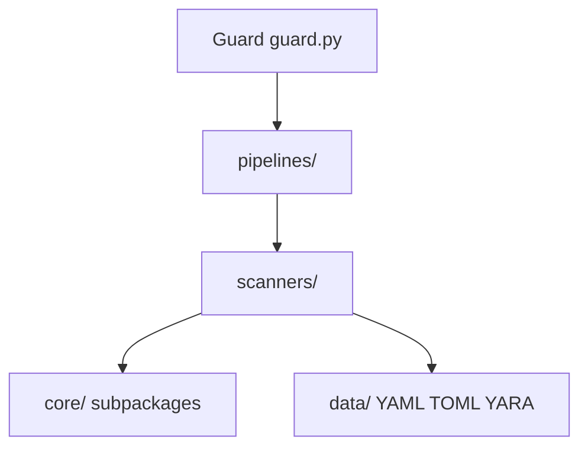

# Unplug SDK Architecture

**Unplug the bad AI.**

Public-safe overview of the `unplug-ai` Python SDK (`import unplug`).

## Layering



**Rule:** Guard → Pipelines → Scanners → Core. Never skip layers.

| Layer | Role |
|-------|------|
| `guard.py` | Entry point: config, registry, scan API, session taint |
| `pipelines/` | Input, output, tool-call orchestration; fail-closed wrapper |
| `scanners/` | Detection: regex, YARA, Presidio PII, ML span |
| `core/` | Engine primitives: taint, normalize, policy, agent hardening, privacy, runtime |
| `data/` | Packaged patterns (YAML), maps (TOML), YARA rules: no Python logic |
| `optional/` | Fail-loud import boundaries for extras |
| `ml/` | Span models, HF catalog, checkpoint store |
| `config/` | Pydantic GuardConfig, loader, policy, limits |
| `api/` | Wire types: Finding, ScanResult, Action, Source |

## Trust and taint

`TaintedText` carries provenance (`TrustLevel`: USER, TRUSTED, TOOL_OUTPUT, RETRIEVED, EXTERNAL, UNKNOWN). Scanners gate on trust, e.g. leakage skips USER/TRUSTED; harmful scans tool output and retrieved content.

Session taint tracks cross-turn contamination from fetch/RAG tools.

## Fail-closed

Scanner or pipeline errors produce a full-span `Finding` with `stage="error"` and `score=1.0` and never allow silently.

## Optional extras

| Extra | Module | Used by |
|-------|--------|---------|
| `presidio` | `optional/presidio.py` | `scanners/pii.py` |
| `yara` | `optional/yara.py` | `scanners/yara_scanner.py` |
| `ml` | `optional/ml.py` | `ml/store.py`, span models |
| `haystack` | `integrations/haystack.py` (lazy Haystack import) | RAG document guard |
| `litellm` | `optional/litellm.py` | `judge/litellm_judge.py` |
| `scrape` | `optional/scrape.py` | `providers/content/firecrawl.py` |

If a scanner is listed in config but its extra is missing, `Guard.__init__` raises `ConfigError` with an install hint (`pii`, `yara`).

## Concurrency and session state

Use **one `Guard` per request or agent session**. `ExecutionContext` tracks session taint, tool history, trajectory, and normalize cache — shared concurrent scans on the same instance can race.

For server embeddings and streaming, prefer `scan_request(..., isolated=True)` or a fresh `ExecutionContext` per call so scan cache and policy overrides do not bleed across tenants.

## Public API

Stable imports from `unplug`:

```python
from unplug import Guard, Finding, ScanResult, TrustLevel, GuardConfig, ScanPolicy, ConfigError, ServerError
```

Everything else: submodule imports (`from unplug.scanners.injection import InjectionScanner`).

## Deprecated paths

| Old | New | Removed |
|-----|-----|---------|
| `unplug.safeguards.*` | `unplug.scanners.*` | v1.0 |
| `unplug.scanners.*` shims (pre-0.4) | real code in `scanners/` | done |
| Flat `unplug.core.*` modules | `core/{taint,normalize,policy,...}/` + shims | v1.0 |

## Related docs

- [PUBLIC_API.md](PUBLIC_API.md): what is importable and what is internal
- [AGENT_FLOW_SECURITY.md](AGENT_FLOW_SECURITY.md): how taint moves through an agent loop
- [TESTING_HARNESS.md](TESTING_HARNESS.md): which suite covers which layer
