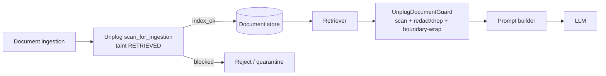

# RAG defense threat model

Most teams that "handle prompt injection" only guard the user turn. The
retrieval-augmented path is the gap: a document in your store, or one fetched
live from the web, is rendered into the prompt as if it were trusted, so an
attacker who can influence a single indexed document can inject instructions
into every query that retrieves it.

## Where the payload enters

Two independent choke points, because either alone is insufficient:

- **Ingestion-time** (`scan_for_ingestion`): the cheapest place to stop a
  poisoned document. It never reaches the store, and clean documents are
  stamped `unplug_ingest_scanned=True`. But it cannot protect against documents
  indexed before the guard existed, or stores you do not control.
- **Retrieval-time** (`UnplugDocumentGuard`): the backstop that runs on every
  query, covering pre-existing and third-party content. This is the one you
  cannot skip.

## What the retrieval guard does per document

1. **Scan** the content as untrusted `RETRIEVED` input (full injection /
   leakage / URL pipeline, including the malicious-URL scanner that catches
   markdown-image exfiltration links).
2. **Decide**:
   - `BLOCK` → **drop** the document (default) or redact it to a placeholder.
   - `REVIEW`/redactable → **redact** the offending span, keep the rest.
   - clean → **boundary-wrap** so the content is fenced as untrusted and cannot
     impersonate system text downstream.
3. **Annotate** survivors with `unplug_action` and `unplug_risk` metadata, and
   return a batch `report` (counts + `max_risk` + flagged indices) for logging.

## Trust mapping

Document metadata is mapped to an Unplug `TrustLevel`:

| Metadata signal | Trust level |
|-----------------|-------------|
| `source` contains web/url/http/external/crawl, or `content_type: text/html` | `EXTERNAL` |
| `unplug_ingest_scanned == True` | `RETRIEVED` (already vetted) |
| anything else | `RETRIEVED` |

All retrieved content is scanned as untrusted regardless; the trust level is
recorded so EXTERNAL (live-web) hits stay visible in the report even when they
pass.

## What this does not do

- It does not vouch for factual accuracy or relevance. That is the retriever's
  job, not a security control.
- It does not decrypt or introspect binary attachments; scan extracted text.
- Boundary wrapping is a defense-in-depth signal to the model, not a hard
  guarantee. Pair it with a system prompt that treats wrapped content as data.
