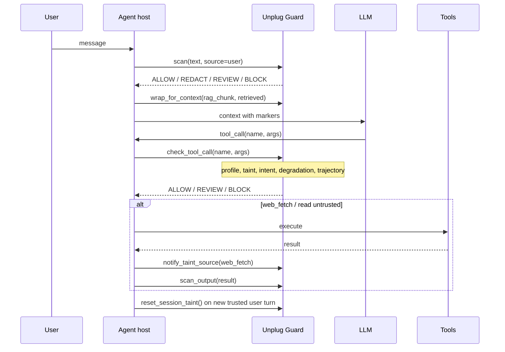

# Agent flow security - Hermes Agent, OpenClaw, and Unplug SDK

**Updated:** 2026-06-01  
**Scope:** Techniques for securing LLM agent *flows* (not host sandboxing). Maps external patterns to SDK hooks.

**Deep dive:** [HERMES_AGENT_SECURITY.md](./HERMES_AGENT_SECURITY.md) (NousResearch/hermes-agent).

---

## Terminology

| Term | Meaning |
|------|---------|
| **Hermes Agent** | [NousResearch/hermes-agent](https://github.com/NousResearch/hermes-agent) - skills, context files, cron, terminal tools. Uses `threat_patterns.py` + `skills_guard`. |
| **OpenClaw** | Open-source agent runtime (gateway + tools). See [OpenClaw security docs](https://docs.openclaw.ai/gateway/security). |
| **Adaptive degradation** | SDK `[degradation]` - tighten high-risk tools after crescendo (OpenClaw blast-radius idea). |

---

## OpenClaw - techniques that apply to the SDK

OpenClaw separates **where tools run** (Docker sandbox), **which tools exist** (allow/deny), and **who can talk to the agent** (pairing). Only the middle layer is fully expressible inside Unplug; the rest is host responsibility.

| Technique | OpenClaw mechanism | Unplug SDK |
|-----------|-------------------|------------|
| Untrusted context | Treat RAG/web/tool output as non-instructional | `BoundaryConfig`, `Guard.wrap_for_context()`, `auto_wrap_untrusted` |
| Tool deny wins | `tools.deny` overrides allow | `LimitConfig.blocked_tools`, `ToolProfile` (readonly/messaging/full) |
| Side-effect vs read-only | Sandbox tool policy + elevated escape hatch | `ToolPolicyConfig` side-effect + session taint |
| Blast radius on weak models | Disable `web_fetch` / `exec` / browser when model is small | `DegradationConfig` high-risk patterns (tighten after crescendo) |
| Crescendo / multi-turn escalation | Operational guidance + monitoring | `TrajectoryConfig` + `risk_trajectory` |
| Channel trust | DM pairing, allowlists | **Host** (not SDK) |
| Container isolation | `sandbox.mode: all` | **Host** (Docker) |
| Elevated exec on host | `tools.elevated` bypasses sandbox | **Host** - SDK can still REVIEW/BLOCK tool names |

---

## Hermes Agent - techniques

| Technique | Hermes | Unplug SDK |
|-----------|--------|------------|
| Context file scan | `AGENTS.md`, `.hermes.md`, `.cursorrules`, `SOUL.md` | `Guard.scan_context_file()` |
| Assembled prompt scan | Cron + skill body at runtime | `guard.scan(assembled, source="retrieved")` before agent start |
| Multi-word injection regex | `(?:\w+\s+)*` between tokens | Updated `ignore_previous` + `hermes_*` patterns |
| Skills quarantine | `skills_guard.scan_skill` | `scan_context_file` on SKILL.md / DESCRIPTION.md |
| Persona jailbreak "Hermes" | N/A (attack) | `named_persona_hermes` in injection scanner |

---

## Adaptive degradation (SDK)

| Technique | Idea | Unplug SDK |
|-----------|------|------------|

| Technique | Idea | Unplug SDK |
|-----------|------|------------|
| **Monotonic confinement** | Privileges only shrink without explicit approval | `ExecutionContext.degradation_level` only increases until `reset_session_taint()` |
| **Crescendo detection** | Escalating risk scores across turns | `TrajectoryConfig` -> trajectory findings |
| **Adaptive degradation** | High-risk tools blocked/reviewed after escalation | `DegradationConfig` + `degraded_tool_findings()` |
| **Intent vs action** | Informational ask + destructive tool -> hold | `IntentConfig` |
| **Provenance / signed segments** | Signed context envelopes (Tessera mesh) | Taint + boundary markers (not cryptographic yet) |
| **ABSTAIN band** | Uncertain scores -> judge/redact, not hard block | Training stack (`repos/unplug_exp/lib/decision.py`); wire to SDK `Action` in a follow-up |
| **Plan-then-execute** | Lock control flow before ingesting untrusted tool data | **Host** orchestration; SDK can scan plan text as `Source.SYSTEM` |

References: SafeHarness lifecycle layers (Inform / Verify / Constrain / Correct), [RiskGate / viability framework](https://arxiv.org/abs/2604.24686), [Progent monotonic policies](https://arxiv.org/pdf/2504.11703).

---

## Recommended agent host flow

---

## Configuration (SDK)

See `unplug.example.toml` sections: `[boundaries]`, `[trajectory]`, `[intent]`, `[degradation]`, `[tools]`, `[limits]`.

---

## Out of scope (host / infra)

- Docker sandbox, network egress, credential brokering (Nomos-style execution firewall)
- MCP gateway auth, signed context segment PKI
- Channel pairing, gateway bind address, filesystem permissions

These remain the operator's job; Unplug enforces **text and tool-call policy** at the agent boundary.
