# Deployment architecture

> **Status (2026-07-28).** Only the **local embedded** path is generally available today.
> The **hosted** path is not live: `api.unplug-ai.org` does not currently resolve, and the
> public site lists it as "coming soon (founding waitlist)". The **local sidecar** path
> depends on `unplug-server`, which is not yet public.
>
> `Guard(mode="server")`, `UnplugClient` and the `unplug-sidecar` CLI are implemented and
> tested in the SDK — they are clients waiting on a service. This document describes the
> intended architecture; treat the hosted and sidecar sections as forward-looking.
>
> Integrating today? Use **local embedded**: `Guard()` or `Guard.with_tiny()`.

Unplug has **one HTTP API** (`unplug-server`) and **one SDK** (`unplug-ai`). Who runs the server and where the ML model loads depends on the deployment path.

```mermaid
flowchart TB
  subgraph hosted [Hosted: Unplug operates]
    VM[unplug-server on VM]
    Keys[API keys per customer]
    VM --> Keys
    CustSDK1[Customer SDK mode=server]
    CustSDK1 -->|Bearer token| VM
  end

  subgraph embedded [Local embedded: customer operates]
    Agent[Agent process]
    Guard1[Guard mode=local]
    ML1[injection_ml in-process]
    Agent --> Guard1 --> ML1
  end

  subgraph sidecar [Local sidecar: customer operates]
    Sidecar[unplug-server localhost]
    Agent2[Agent process]
    Guard2[Guard mode=server]
    Agent2 --> Guard2 -->|no API key| Sidecar
  end
```



## Three paths (pick one)

| Path | Who runs the server | ML location | Customer installs |
|------|---------------------|-------------|-------------------|
| **Hosted** | Unplug (your VM) | Your VM | SDK only + API key |
| **Local embedded** | Nobody | Same Python process as `Guard` | SDK + `[ml]` + checkpoint |
| **Local sidecar** | Customer (Docker/local) | Local `unplug-server` | SDK + sidecar container |

### Hosted (planned — not yet available)

> Not live today: the endpoint does not resolve and there is no public sign-up beyond the
> waitlist. The design below is the intended shape, not a path you can adopt now.

**You** deploy `unplug-server` behind TLS, issue API keys, and bill/meter usage.

Customers integrate with:

```python
guard = Guard(mode="server")  # UNPLUG_SERVER_URL + UNPLUG_API_KEY
```

They never clone `unplug-server`, never download checkpoints, and never need a GPU.

Tool enforcement (`check_tool_call`, toolchain, collusion) **always runs in the SDK** today: hosted mode covers text scan/output only.

### Local embedded (simplest offline ML)

For a single Python agent, air-gapped environments, or "just pip install and go":

```bash
pip install "unplug-ai[ml]"
unplug-models download tiny
```

```python
guard = Guard()  # active_model=tiny in unplug.toml
```

The span model loads inside the agent process. No HTTP server, no API key. Each process loads its own copy of the weights (fine for one agent; wasteful if many processes share one GPU).

### Local sidecar (shared local ML)

When customers want **local ML** but also want:

- one model load shared across many agent processes
- non-Python clients calling the same scan API
- identical wire format as hosted (easy env switch)

They run **the same `unplug-server` binary** you operate in prod: just locally, without auth:

```bash
# From unplug-server repo (or docker-compose.sidecar.yml)
export UNPLUG_CACHE_BACKEND=memory
export UNPLUG_API_KEYS=
export UNPLUG_MODEL_TIER=tiny
export UNPLUG_SLM_MODEL_PATH=/path/to/checkpoint-66630
make run
```

SDK points at localhost:

```python
guard = Guard(mode="server", server_url="http://127.0.0.1:8000")
# no UNPLUG_API_KEY when UNPLUG_REQUIRE_API_KEYS=false
```

Use `unplug-sidecar doctor` to verify the sidecar is reachable before starting agents.

## Decision guide

| Requirement | Path |
|-------------|------|
| **Anything you need working today** | **Local embedded** (the only GA path) |
| Production, no GPU on customer side | Hosted *(planned, not yet available)* |
| Offline / air-gapped single agent | Local embedded |
| Multiple local agents, one GPU | Local sidecar *(needs unpublished `unplug-server`)* |
| Switch hosted <-> local without code changes | Local sidecar or hosted (both use `mode=server`) |
| Regex only, zero ML deps | Local embedded, no `active_model` |

## Environment variables (by path)

| Variable | Hosted | Embedded | Sidecar |
|----------|--------|----------|---------|
| `UNPLUG_SERVER_URL` | your API | - | `http://127.0.0.1:8000` |
| `UNPLUG_API_KEY` | required | - | omit |
| `UNPLUG_ACTIVE_MODEL` | - | `tiny` | - |
| `UNPLUG_MODEL_PATH` | - | checkpoint dir | - (server env instead) |

## What we do not ship to customers

- Hosted VM provisioning (internal ops)
- API key dashboard (product surface, separate repo)
- A second "local server" product: sidecar **is** `unplug-server` with a dev profile

## Related

- [`examples/hosted_client.py`](../examples/hosted_client.py): hosted API key flow
- [`examples/local_sidecar_client.py`](../examples/local_sidecar_client.py): localhost server flow
- `unplug-server`: server source and `docker-compose.sidecar.yml` — separate repository, not
  yet public (the previous relative link here pointed outside this repo and did not resolve)
