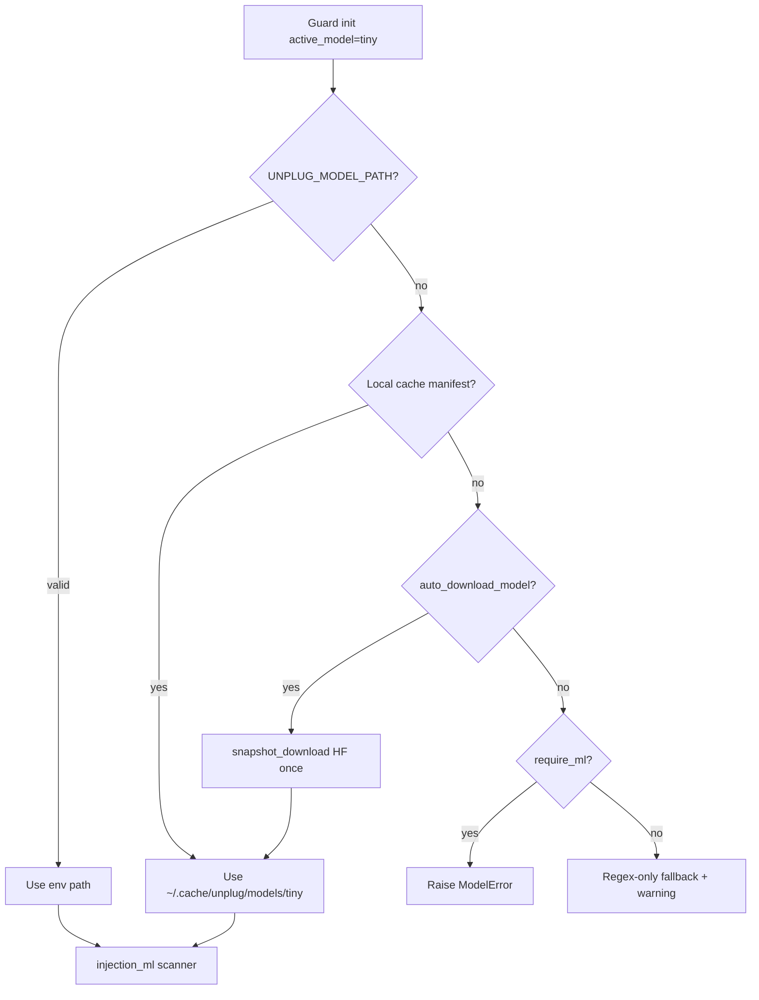

# SDK hardening plan - models, eval, and developer UX

**Status:** Active (2026-06-01)  
**Goal:** Devs install once, model downloads once, ML always wired when enabled, optional BYOLLM for smoke testing.

---

## Phase 1 - Done

| Item | Implementation |
|------|----------------|
| Fix pytest noise | `filterwarnings` in pyproject + `clean_up_tokenization_spaces=False` on tokenizer load |
| Model catalog | `src/unplug/models/catalog.toml` - `tiny` / `medium` / `large` + HF `repo_id` |
| Download once | `ModelStore` -> `~/.cache/unplug/models/<tier>/` + `manifest.json` |
| CLI | `unplug-models list \| download \| upgrade \| status` |
| Guard wiring | `merge_catalog_models`, `auto_download_model`, `require_ml` |
| Optional LiteLLM | `pip install 'unplug-ai[litellm]'` + `create_litellm_judge()` |
| Tier rename | Default tier **`tiny`** (not `small`); env `UNPLUG_ACTIVE_MODEL=tiny` |
| Lint / format | Ruff (`E`, `F`, `I`, `N`, `W`, `UP`, `B`, `SIM`, `RUF`); `make fix` / `make check` |
| CI parity | `make check-ci` mirrors GitHub Actions (exfil demo + security subset) |

---

## Phase 1.5 - SDK cleanup (2026-06-01, done)

| Item | Implementation |
|------|----------------|
| Audit ML messaging | `unplug-audit` reports three checks: `ml_checkpoint`, `ml_configured`, `ml_active` (informational by default; required with `--require-ml`) |
| Path auto-wire | `UNPLUG_MODEL_PATH` alone sets `active_model=tiny` via config loader |
| Safeguards migration | Canonical scanners in `unplug.safeguards.*`; `unplug.scanners.*` are deprecation shims only |
| Registry | `SafeguardRegistry` imports all builtins from `safeguards/` |
| CI security | `test_agent_hardening.py` in CI security job + `make check-ci` |
| ModelRegistry | Removed unused `get_or_none()` (fail-closed: use `get()` or handle errors explicitly) |

**Import guidance:** use `from unplug.safeguards.destructive import DestructiveScanner` (not `unplug.scanners.*`). Shims remain until a breaking release.

**Local gates:**

```bash
cd sdk && uv sync --all-extras --dev
make fix          # ruff --fix + format
make check        # lint + format --check + pytest -q
make check-ci     # check + exfil demo + security regression subset
make test-security  # adversarial, encodings, agent hardening, financial, ...
```

**`unplug-audit` ML checks:**

| Check | Meaning |
|-------|---------|
| `ml_checkpoint` | Valid checkpoint dir on disk (env, cache, or workspace default) |
| `ml_configured` | `active_model` set in loaded config |
| `ml_active` | `injection_ml` wired and weights loaded (eager `load()` for health) |

With `--require-ml`, all three must pass for `wiring_pass`. Without it, regex-only installs stay valid; CLI prints a hint if checkpoint exists but ML is inactive.

---

## Phase 2 - Before PyPI + v1.22 model ship

### 2.1 Publish Hugging Face checkpoint

1. Run `golden_eval.py` - all **required** gates green (`benchmark_holdout.json`).
2. `export_slim_checkpoints.py` -> upload to `UnplugAI/unplug-tiny-v122`.
3. Update `catalog.toml` revision pin to release tag (not `main`).
4. Smoke: `unplug-models download tiny` on clean machine -> `unplug-audit --require-ml --probes`.

### 2.2 SDK test plan (pre-ship checklist)

```bash
cd jakarta/sdk && uv sync --all-extras --dev

# 0. CI-equivalent gate (run before every PR)
make check-ci

# 1. Regex-only baseline
make check
uv run unplug-audit

# 2. Local checkpoint (dev / CI with artifact)
export UNPLUG_MODEL_PATH=/path/to/checkpoint-slim
# UNPLUG_ACTIVE_MODEL=tiny optional - path alone auto-selects tiny
uv run unplug-audit --require-ml --probes
python examples/agent_exfil_demo.py
python scripts/smoke_local_ml.py

# 3. Golden gates (training repo - ship authority)
cd repos/unplug_exp && python scripts/golden_eval.py

# 4. Optional BYOLLM smoke (needs API key)
pip install 'unplug-ai[litellm]'
# Guard(judge=create_litellm_judge("gpt-4o"), config=GuardConfig(judge_enabled=True))
```

### 2.3 Wire ABSTAIN band (v1.22 training)

- Training: `repos/unplug_exp/lib/decision.py` (`ALLOW | ABSTAIN | BLOCK`)
- SDK follow-up: add `Action.ABSTAIN`, map abstain->redact_spans in `injection_ml` + policy
- Optional: abstain -> LiteLLM judge when `judge_enabled`

---

## Phase 3 - Developer defaults (recommended `unplug.toml`)

```toml
[guard]
active_model = "tiny"
auto_download_model = true   # first Guard() downloads if missing
require_ml = true            # production: fail fast if model unavailable
```

**Override paths (no re-download):**

| Env / config | Effect |
|--------------|--------|
| `UNPLUG_MODEL_PATH` | Use this checkpoint dir; auto-enables `active_model=tiny` if tier not set |
| `UNPLUG_ACTIVE_MODEL` | Explicit tier (`tiny`, `medium`, `large`) |
| `UNPLUG_MODEL_CACHE` | Change cache root (default `~/.cache/unplug/models`) |
| `[models.tiny].path` | Explicit path in config |

**Upgrade flow when catalog revision changes:**

```bash
unplug-models list          # shows "upgrade available"
unplug-models upgrade tiny  # re-downloads, updates manifest
```

---

## Phase 4 - Optional BYOLLM (not production default)

For teams that **skip** unplug-tiny and use their own LLM for borderline cases:

```bash
pip install 'unplug-ai[litellm]'
```

```python
from unplug import Guard
from unplug.config.guard import GuardConfig
from unplug.judge.litellm_judge import create_litellm_judge

guard = Guard(
    judge=create_litellm_judge("gpt-4o"),  # or any LiteLLM model string
    config=GuardConfig(judge_enabled=True, judge_low=0.3, judge_high=0.8),
)
```

Judge runs only on **borderline** scores (between `judge_low` and `judge_high`). Use for SDK integration testing - **not** as a replacement for golden eval on unplug-tiny.

Missing extra -> Agno-style error:

```
LiteLLM judge requires optional dependency 'litellm'.
Install with: pip install 'unplug-ai[litellm]'
```

---

## Phase 5 - CI / release blockers to clear

| Blocker | Owner | Gate |
|---------|-------|------|
| v1.22 NotInject FPR ≤ 2% | training | `golden_eval.py` |
| HF repo live | release | `unplug-models download tiny` |
| ABSTAIN in SDK | SDK | follow-up PR |
| Harmful-content model | separate workstream | not injection_ml |
| Lint / CI green | SDK | `make check-ci` |

---

## Architecture (model path resolution)



---

## Files reference

| Path | Role |
|------|------|
| `src/unplug/safeguards/` | Canonical threat scanners + registry |
| `src/unplug/scanners/` | Deprecation shims -> `safeguards.*` |
| `src/unplug/models/catalog.toml` | Tier definitions + HF repos |
| `src/unplug/ml/store.py` | Cache + download |
| `src/unplug/ml/catalog.py` | Load catalog |
| `src/unplug/core/model_runtime.py` | Guard integration |
| `src/unplug/cli/models.py` | `unplug-models` CLI |
| `src/unplug/cli/audit.py` | `unplug-audit` CLI |
| `src/unplug/audit/runner.py` | Wiring + ML health checks |
| `src/unplug/judge/litellm_judge.py` | Optional BYOLLM |
| `Makefile` | `check`, `check-ci`, `fix`, `test-security` |
| `docs/ML_INTEGRATION.md` | Ship checklist |
| `repos/unplug_exp/configs/benchmark_holdout.json` | Golden gates |
